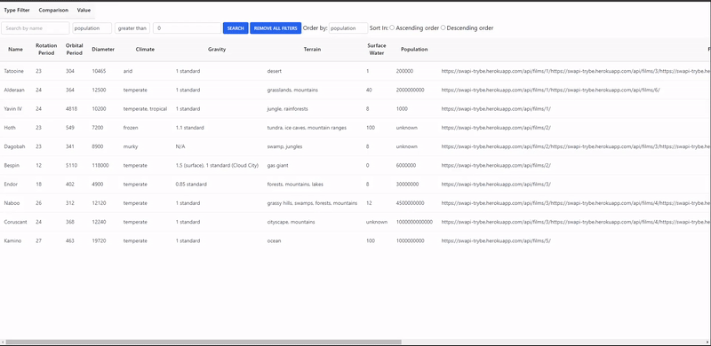

    

<h1 align="center">StarWars Planets Search</h1>
<p align="center">Uma aplicação que consulta uma API para recuperar dados dos planetas do universo de Star Wars e filtra de acordo com os comandos do usuário.</p>
<p align="center"> 
  
 </p>

# Sumário

• [Sobre o Projeto](#-sobre-o-projeto)

• [Tecnologias utilizadas no desenvolvimento do projeto](#-tecnologias-utilizadas-no-desenvolvimento-do-projeto)

- [Como executar o projeto](#-como-executar-o-projeto)
  - [Remotamente](#remotamente)
  - [Localmente](#localmente)

### 💻 Sobre o Projeto

<p>Uma aplicação que consulta uma API para recuperar dados dos planetas do universo de Star Wars, com os dados retornados pela API é criado uma tabela onde é possivel utilizar de alguns filtros, os planetas poderão ser filtrados por suas características, como população, período orbital, diâmetro e outras.</p>

### 🛠 Tecnologias utilizadas no desenvolvimento do projeto

- **[React](https://github.com/facebook/react)**
- **[React Router Dom](https://github.com/ReactTraining/react-router/tree/master/packages/react-router-dom)**
- **[Context API](https://tailwindcss.com/)**
- **[Tailwind](https://getbootstrap.com/)**
  > Veja o arquivo [package.json](https://github.com/andremarquezz/ProjetoStarWarsPlanets/blob/main/package.json)

# 🚀 Como executar o projeto

### Remotamente

_Copie a URL abaixo e cole no seu navegador_

```jsx
https://projetowallet.vercel.app/
```

### Localmente

_Pré-requisitos_

Antes de começar, você vai precisar ter instalado em sua máquina as seguintes ferramentas:
[Git](https://git-scm.com), [Node.js](https://nodejs.org/en/).
Além disto é bom ter um editor para trabalhar com o código como [VSCode](https://code.visualstudio.com/)

_1- Clonar o repositorio_

```jsx
git@github.com:andremarquezz/ProjetoStarWarsPlanets.git
```

_2- Executar o comando abaixo no terminal, dentro da pasta do projeto._

```jsx
npm install
```

_3- Executar o comando abaixo no terminal, dentro da pasta do projeto._

```jsx
npm start
```
